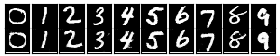

# Image-Generation-And-Translation
Implementation and additional results of ["Image Generation and Translation with Disentangled Representations"](https://arxiv.org/abs/1803.10567).

The work presented here was done at the [Knowledge Technology Research Group](https://www.inf.uni-hamburg.de/en/inst/ab/wtm/ "Knowledge Technology Research Group") at the University of Hamburg and accepted as a conference contribution to the [IJCNN 2018](http://www.ecomp.poli.br/~wcci2018/).

## To Run the Experiment on MNIST Data Set
Requirements:
* Tensorflow 1.5.0
* Numpy 1.14.1

Run Experiment:
* run `python code/train_mnist.py`
Results are stored in code/log_dir/mnist_sem_sup
* to visualize results: `tensorboard --logdir code/log_dir/mnist_sem_sup`
* for each experiment run log_dir also contains a file info.txt detailing the generator and encoder accuracy after X iterations, as well as other information about the training progress

To evaluate the results:
* run `python code/evaluate_model.py --model_dir dir-where-model-weights-are-stored` with one of the following flags:
    * `--generate`: generates samples varying the categorical and continuous parts of the disentangled part of the representation and stores the result in "model_dir/samples"

    | Generated categorical | Generated continuous 1 | Generated continuous 2 |
    |---|---|---|
    |  |  |  |
    * `--translate`: translates images from the test set according to the categorical and continuous parts of the disentangled part of the representation and stores the result in "model_dir/samples". The first column of each image depicts the original image, the following columns depict the translations according to the variables in c. The categorical translation translates an image into each of the 10 digits, while the continuous translation takes an image and sets the encoding of one continuous variable to {-1, 0, 1}

    | Categorical translation | Continuous translation |
    |---|---|
    |  |  |
    * `--interpolate`: interpolates between images. When prompted type the start digit (digit which should be in the start image) and end digit (digit which should be in the end image). Results are stored in "model_dir/samples"

    | Interpolation 2 to 7 | Interpolation 4 to 9 | Interpolation 5 to 8 |
    |---|---|---|
    |  |  |  |
    * `--reconstruct`: samples images from the test set, encodes them, and gives the encoding to the generator for reconstructions. Results are stored in "model_dir/samples"

    | Reconstruction Example 1 | Reconstruction Example 2 |
    |---|---|
    |  |  |
